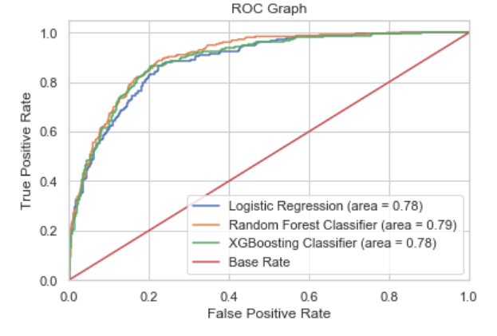
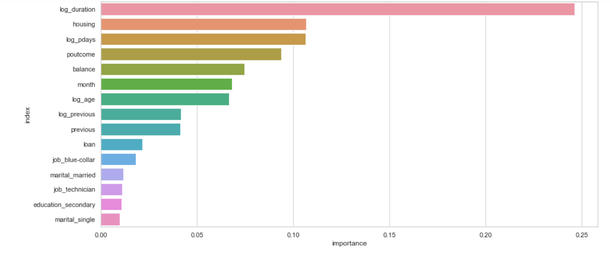

# bank-marketing 

# Introduction
Nowadays, marketing is so essential for every business to promote their brand image and attract more customers. The cost of marketing is also intimidating, meaning that it is essential for the business to optimize marketing strategies and improve effectiveness. Understanding customers’ need also leads to more effective marketing plans, smarter product designs and greater customer satisfaction.

# Problem Statement and Goal
How can the bank have a greater effectiveness for future marketing campaigns? In order to answer this, we have to analyze the last marketing campaign the bank performed and identify the patterns that will help us find conclusions in order to develop future strategies. 

Our goal is to find the best strategies to improve for the next marketing campaign to better target customers who are more likely to subscribe term deposits. The bank can then put more effort into marketing these customers. This will not only help the bank get more deposits but also save unnecessary marketing expenses on those people who will not subscribe.

# Data Collection
This dataset is about the direct phone call marketing campaigns, which aim to promote term deposits among existing customers, by a Portuguese banking institution from May 2008 to November 2010. It is publicly available in the [UCI Machine learning Repository.](http://archive.ics.uci.edu/ml/datasets/Bank+Marketing#)

# Preprocessing
- Generally speaking, the dataset is in good condition with no missing values and duplicates and with mix of categorical and numerical variables.
- By inspecting the target variable, I understand that this is an imbalanced dataset.
    
   
- According to what the data description shows, outliers in one of the core columns 'balance' have been detected and been removed based on IQR rule.
- For easy understanding, yes/no in the target column has been converted into 1/0 and -1 in the pdays has been converted into 0, which means the client has not been contacted.

# Exploratory Data Analysis
In this part, we are going to investigate the distribution of each variable and how they get correlated with each other. Visualizations are shown below to reveal key insights.

##  Distributions for each numerical feature

Insights:
- The distribution of customer age is quite extensive, from 18 to 95. However, most of them are in the mid-age(30s-40s).
- The balance distribution is also wide spread, suggesting a large variability in customer balances.
- The duration of contact has a median about 300 seconds and most of them are very short, but there are still a number of large outliers which worth being investigated.
- Half of the clients were contacted by the bank for the second time and most of them are contacted by one to three times. However, some clients are contacted by 58 times at most, which is abnormal. It may be because these clients have special needs from the bank.
- Most clients are contacted recently or never been contacted and only a few has been contacted a few years ago.
- Most clients hasn't been contacted before this compaign and only a few get contacted many times.
- Furthermore,  age,balance,pdays and previous are a little bit skewed which could potentially bias our model later on. In a subsequent step, we will apply log transformation on these features.

## Correlation between numerical features

The cross-correlation revealed relatively strong relationship between our target feature and the last contact duration. There is also a mild correlation between subscription and pdays, balance or previous. The correlation is similar which is close to 0.1. Now, we would need to keep these relationship in mind since there seems to be some collinearity between the explanatory features as well(e.g. previous vs pdays, day vs campaign).

## Plots Regarding Target Feature

Insights:
- Older and younger people are more likely to subscribe the term deposit. It makes sense since term deposit is the least risky investment which is suitable for these two groups of people.
- Clients with average or high balance are more likely to subscribe. In the future, the bank should focus more on these group of people.
- Longer contact duration is more likely to lead to a campaign success.
- People who have a contact period of about 150 days from contact by previous campaign are more likely to subscribe.
- There is no significant difference of subscription on last contact day of the month and number of contacts performed during and before this campaign.

## Barplots of Categorical Features with respect to Target Variable
Calculate probability of subscription based on the category and draw the barplot for each category.

Insights:
- Students and retirees are the major customers for the deposit description, which aligns with the previous finding about age.
- People with higher education tends to be more likely to subscribe.
- People who don't have credit in default or who don't have housing or personal loan should be targeted customers.
- The success of marketing campaign is largely affected by the effect of previous campaign.
- The marketing campaign is recommended to initiate during fall or spring as these two seasons seem to yield a better result.
- The contact method doesn't affect too much about client's choice of subscription.

# Feature Engineering
It is necessary to deal with features to help produce models with better performance, what I do in this part is:
- Removing unnecessary features based on EDA. ('contact','day','campaign' are removed)
- Log-Transform the skewed column 'age','duration','pdays' and 'previous.
- Standarization of numerical features to help fit in the logistic regression.
- Drop 'unknown' and 'other' values.
- Label encoding and one-hot encoding for categorical features.

# Modeling
- I choose precision as our target metric for our models since we want to limit false positives which include people who are predicted as target customers who will subscribe but actually are not, and we choose three robut machine learning models to solve this problem: Logistic Regression, Random Forest and XGBoosting.
- I chose 4/3-1/4 as my train-test split for models. 
- We predict all zeroes in our test set as our base model, with the precision of 0%.
- As we mentioned earlier, we have an imbalanced dataset. So I decide to use SMOTE to use the nearest neighbors of the minority observations to create new synthetic and balanced data.
- all models are created and hyperparameter tuning has been done through randomizedSearchCV for all models.
- Test each model by 5-fold corss-valiadation and return the metric precision for each model.

The results of the classification models, all of which used hyperparameter grid search, are shown below:
| Model             | precision through CV on trian set | precision on the test set|
| ----------------- |:-------------:| ------:|
| Logistic Regression  | 86.37%| 60.96%|
| Random Forest | 87.87% | 65.11%|
| XGBoost|88.60%|64.93%|

ROC graph:

As we can see, the three models behave in a similar performance. Random forest is the most successful model which effectively limit false positives in the test set.

# Feature Importance

# Next Steps
Now we can use our model to develop a new marketing strategy. Then the new email campaign strategy will be: only send email to users which my random forest model predicts positive.
according to its predictive result on test set:
- my model only need to do 26% of the old call amount, saving 74% amount.
- my model will cover 70% of valued users which will subscribe the deposit.
- 65.11% of the receiver will subscribe. compare with old strategy, whose subscription rate is 11.7% , my new strategy can be almost six times the subscription rate.

# Final Recommendations
## Target Customer:
- Age: Young and old people (typically age<30 and age>60)
- Balance: People with relatively high balance (typically balance>1000)
- loan: People who do not have housing or private loans.
- Outcome from last campaign: People who indicate a successful outcome of the previous marketing campaign.
- Old customers: People who was previously get contacted before. 

## Seasonal Marketing
Marketing timing is an very essential for businesses. As we observe from EDA and feature importance, marketing seasons make a difference in results. It appears that spring and autumn marketing campaigns are the most successful. The bank should consider initiating its telemarketing campaign in fall and spring.

## Strategy Marketing 
Marketing strategy is also key factor of success. Here is a tip to improve possibility of campaign success: Try best to make the campaign engaging, so the customer is willing to participate in a long duration. Longer contact duration potentially indicates a success.

